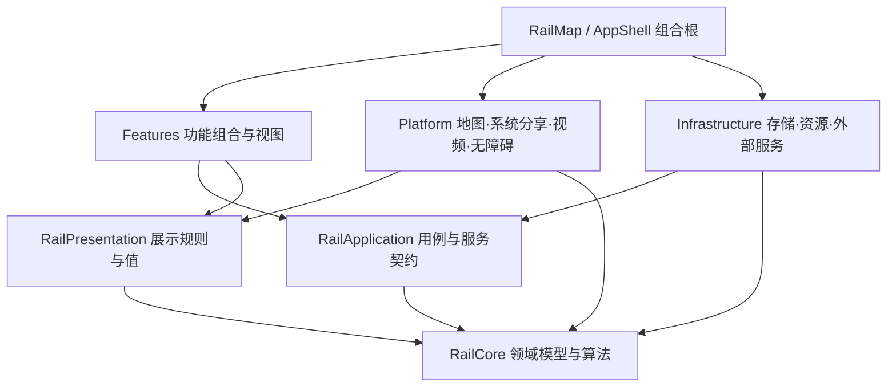

# iOS 全代码库重构方案

## 第 26 阶段后的当前验收入口（2026-10-09）

此节更新下方第 18 阶段时点的“当前”状态，原始 S0–S6/M 目标及门槛不变。已推送 `main` 为 `922b7541b0e5048ca6f95269437055f726adf7a9`，阶段 20–26 的实现和精确验证见 [阶段交付记录](REFACTOR_PHASE_COMMITS.md)。并行 CLI 工作树不属于这些提交的验收。

- 质量：固定版本复杂度 >15／函数长度 >60 校准已交付；新增 lint 债务硬门禁已接入 CI 并通过，保留 270 条既有全 Swift 清单 findings，不用删除旧债抵扣别处新增。生产代码既有 167 条及通常 ≤10／≤40 目标继续开放；格式检查仍为 advisory。
- 功能：原 Console 分享 composer 流程、两个组名编辑/保存重启、两个本地自动填入/Undo/pending 服务保存重启分别通过。Undo 保留精确草稿相等守卫，先同步派生方向再捕获快照。五活动地区真实行程全部公开路线生成及 All regions 统计检查通过；该次峰值 1,188,285,896 B，只证明预算内正确性，不是五地区配对 RAM 或泄漏验收。
- 当前完整包：全部 1,437 注册函数、169 套的覆盖率插桩清单按套执行中；337 个服务 pattern 的 674 次 required/optional 检查已全通过，实测峰值 1,277,986,616 B。其余套及 Domain/global 导出未完成前，不宣称整套或覆盖率达标。先前失败及短套采样缺口保留。
- 当前设备矩阵：Main26 精确 507 Swift 文件与实际二进制测试清单一致，137 项/39 类；尚未执行的后段功能已继续逐类验证。旧全矩阵失败、当前缩放 150 ms 门槛失败仍开放，不能把独立修复收据累计为当前全平台 PASS；并行验证也不能替代安静环境性能对照。
- 内存：原双地区 Release 三组对照稳定 footprint -0.54%、峰值 -20.43% 的范围不扩大。区域切层/平移仍会超过 2 GiB：稀疏精确 junction 查询和单帧几何缓存候选分别触及 2,251,821,856 / 2,551,501,816 B，均未交付。Main26 DEBUG 诊断第七次全国图构建期间触及 2,205,766,504 B；事件证实 fallback 活动，尚未归因分配者。下一步细分真实构图峰值，铁路源顶点、拓扑、日期及 pending 守卫不变。
- M：同一静态五姿态公开路径检查证实 iOS 默认参考 5,000 顶点及逆 map-point 偏差 0、所有显示 scale 为 3；像素/同步门槛仍未通过。exact 参考控制具有不同实测描边宽度，不能当作等效精度对照。仅保留诊断候选，不进入默认地图。

继续顺序为关闭实际内存/功能失败、完成全部测试与真实覆盖率，再验收责任目录、iPad/Catalyst、启动/首图/stall/增量构建/零确认泄漏和 M。每个独立验收阶段 commit 并 push main，整体状态仍为**执行中，未完成**。本地 `outputs/` 与 `/private/tmp` 收据是执行附件，精确摘要保存在提交内；临时文件不作为可永久克隆的证据。

## 2026-10-09 最新交付核对：原始路线图继续执行

本节覆盖下文历史段落中的“当前”“最新”“未提交”等时点表述；原始 S0–S6/M 设计继续作为主计划。原始核对基线为 `14d294653fa11e87b6fbfbe3b4eba43f40b65225`，本节生产实现基线为已推送的 `f240ada65564466af2c74de59c2ba98ad32a6b9e`。工作区另有 CLI 数据、分享、新建行程和地图修改，不能把工作树等同于提交版本。逐阶段源码、验证范围和失败收据见 [阶段交付记录](REFACTOR_PHASE_COMMITS.md)；该记录是本计划的证据账，不替代本计划。

用户已授权自动完成重构，并要求每阶段 commit/push `main`、严格减小 memory footprint。已交付 18 个独立阶段，保留 CLI 的未提交内容和两项暂存图标删除。

| 原始目标 / 批次 | 当前提交证据 | 尚需完成的验收 |
| --- | --- | --- |
| S0 / PR-00：资源、归属、冻结基线 | 资源打包可重复；源码归属 280 项、7 checker 与永久字号门禁通过；固定 Main 资源验证无 LFS 指针 | 当前全量测试及全平台矩阵；旧全量进程峰值 2,286,816,064 B 被 2 GiB 守卫中止，未豁免 |
| S1–S3：责任、依赖与生命周期 | Application dated physical proof、地图标签碰撞/选中站点、分享 composer/render owner、NewTrip 保存验证已逐批接线并定向验证；保持三 target 依赖边界 | 稳定功能目录迁移及所有受影响用户流程；不得仅凭文件变短判定完成 |
| 热点 / PR-05：严格降低内存 | 图/输入/显示/统计缓存有界，重型工作串行，取消后拒绝过期结果；Phase 18 的真实 JP/TW Release 三组对照：稳定中位数 418,910,024 → 416,632,456 B（-0.54%），峰值 1,521,208,992 → 1,210,404,320 B（-20.43%） | 仅双地区夹具通过，尚非五地区或零泄漏验收；Phase 17 稳定 footprint +17.37% 的失败保留。Tokyo builder CPU 中位数 +11.25%，后续优化需实测 |
| S4：行为回归 | Compiled graph、严格物理拓扑、缓存取消、日期证明、分享、NewTrip 与双地区真实路线/统计均有局部通过记录；历史 browser boundary 全断言单独通过，峰值 1,938,131,584 B | 当前 Main 全部 SwiftPM：覆盖率插桩构建通过，完整测试清单按套新进程执行中；不得把局部测试相加宣称整套通过 |
| S5：coverage 与质量 | 已交付 LLVM 导出、changed-lines 工具和固定版本 advisory CI；Application 局部 445/464 行 95.905%，该批 changed-lines 49/49 100% | 原目标 changed-lines 75%→85%、Domain/UseCase 80%→90%、global 70–80% 且不回归；需全模块真实覆盖率。复杂度 >15/通常≤10、函数长度 >60/通常≤40、新增 lint 0 尚未完整执行 |
| S6：设备与性能 | 多批 Release arm64/x86_64 构建及定向公开 UI 通过，收据按阶段绑定源码身份 | 全 iPhone/iPad/Catalyst 回归、启动 P95 -15%、首图 P95 -20%、stall -30%、增量 Debug ≤+10%、峰值及零确认泄漏；旧设备记录不可冒充当前整套 |
| M：单地图全视口固定遮罩 | 默认生产方案未替换；公开转换 frame-leading 实验仍有 3–4 device px 偏移及 347.675 ms 帧间隔，NO-GO | 满足底图上/自有铁路下、全视口约 10%、单地图/public API、相机动作和设备性能后才可交付；不放宽 1 px / 150 ms，不改为瓦片遮罩 |

继续顺序：先完成当前 Main 的全量测试和覆盖率，修复实际失败及图构建 CPU/内存热点，再完成质量、设备/性能、稳定责任目录和 M。每个可独立验收阶段都提交并推送 `main`；未运行、失败或未测量项目继续列为开放项。铁路源顶点、真实连接、历史日期、里程和用户 pending 语义不为满足预算而修改。

本地原始收据位于 `outputs/refactor-20261009-resume/`，可能不随 clone 携带；可持久审阅的源码/结果摘要保存在提交内的阶段记录，CI 链接见 Phase 4。整体重构仍未完成。

日期：2026-10-03。状态：**结构迁移、北美退役与严格物理拓扑边界已落地；整体验收仍未收口，进度见 [执行记录](REFACTOR_EXECUTION_20261003.md)。**

本方案覆盖整个 `ios/` 的生产代码、测试、资源装配与相关 CI。采用责任边界迁移，保留已验证的领域算法和活动五地区的用户数据格式；北美数据与兼容功能已按用户要求退役。地图整屏遮罩属于单独的渲染行为变更，不能用目录拆分或普通 MapKit overlay 冒充完成。

## 1. 依据与本轮已完成事项

方案结合本地代码检查、Grok 4.7/xhigh 的只读清点、GPT-6.1 Sol/medium 对旧计划的核对，以及 [ChatGPT Pro 架构咨询](https://chatgpt.com/c/6ac0946b-2768-83ea-8eee-77f6f7cf8a78)。网页使用 Chat 模式与 Pro 档位，已读取完整答复；咨询没有执行本地代码。最终取舍和事实核对由 Codex 完成。

本轮清点的六个源码目录如下，排除同步冲突副本；它们是目录级统计，不代替 S0 的编译 target 成员核验。

| 目录 | Swift 文件数 | 行数（含注释） |
| --- | ---: | ---: |
| `RailMap` | 147 | 62,757 |
| `RailKit/Sources/RailCore` | 71 | 38,727 |
| `RailKit/Sources/RailPresentation` | 29 | 5,152 |
| `RailKit/Tests/RailCoreTests` | 102 | 28,245 |
| `RailKit/Tests/RailPresentationTests` | 30 | 5,218 |
| `RailMapUITests` | 33 | 7,799 |
| 合计 | 412 | 148,552 |

生产代码 247 个文件、106,636 行。规模用于评估迁移范围，不作为拆分目标。较大的协调入口包括 `RailMapView.swift`（4,754 行）、`RideEditorView.swift`（3,699）、`ContentView.swift`（2,982）、`RiddenRouteStore.swift`（2,030）、`RailNetworkStore.swift`（1,782）、`StatisticsView.swift`（1,701）。这些是读取时快照，工作区仍有并发修改。

已经确认的现状：

- `AppShell.swift` 中的 `ContentView` 创建共享 stores 和唯一 `PlaybackController`；`ContentView.swift` 中的 `RailWorkspaceView` 连接地图、工作区和呈现。
- `WorkspaceTabs`、`WorkspacePanelPage`、`WorkspacePanelActions`、`WorkspacePresentations`、`WorkspaceSheetContent` 已存在，不能重新列为待从零提取的模块。
- 地图已有 `RailMapController`、`MapNetworkBuildState`、`MapNetworkGeometryCache`、`MapOverlayInstaller`、`MapLineGeometry`、`MapPlaybackLayer` 等边界。
- `ImportFlow` 已捕获 store generation，提交时及备份挂起后均核验；`RiddenRouteStore.resolve` 已使用 `@concurrent` worker、取消、loadRevision、per-ID ticket。后续应验证并保留，不能按旧计划重新修一次。
- `RailCore` 的实际边界是 Foundation 加只读时刻表 SQLite 例外；`RailPresentation` 依赖 Foundation/RailCore。以 `RailKit/Package.swift` 和当前导入为准，旧文档的“仅 Foundation”描述不完整。
- `REFACTOR_EXECUTION_PLAN.md` 的 2026-09-07 验收及 `AUDIT_PLAN.md` 的旧故障是历史记录，不是今日测试基线。旧的“取消平行车道”等结论也不适用于现有 `MapLineGeometry`。
- 本轮已移除线路高亮时的 `.default`/`.muted` 底图配置切换，更新两处现有测试预期，并完成 arm64 iOS Simulator app build。日志：`/tmp/jtm-remove-highlight-dim-build.log`。本轮没有运行完整 UI 或全部单元测试。

## 2. 重构范围与完成定义

最新产品边界和路线验收以 [功能矩阵的最新规则](REFACTOR_FEATURE_MATRIX.md#最新产品规则与待办范围2026-10-03) 为准：优先核验有依据的直通轨道连接；只有唯一可达且搜索未截断才自动填入区间和推测通过站。行程继续显示推测通过站，默认“通过、时刻未知”，不据此推断停车。多路径支持地图点选与 VoiceOver 卡片；不确定时保存待确认，不强连、不计未确认区间的精确里程。直通车名称和运行系统独立保留。

北美 US/CA 功能和兼容链已移除，仅留仓库备份；Root 已核验三份归档清单的大小/hash 及精确库存覆盖：171 + 21 + 810 = 1,002 个唯一 payload 文件；raw 810 项为当前归档基线，不能作为迁移前原件字节一致的独立证明，编号与兼容功能不列待办。iPhone 已配置永久仅竖屏；scene 根及 UIKit preferred-font 的字号永久限制为 `.xSmall ... .xLarge`，iPad 继续支持四种方向；当前 app/native 构建门禁已通过，iPhone 8 项与 iPad 4 项字号/方向相关检查通过，两台实设系统 AX5 均观测 xLarge；其他设备行为继续按矩阵验收。Web 后端与 Web 工作区不属于本轮 iOS 重构未完成项。设计文档其余后续方案须先确认是否纳入交付范围。底图不透明度与全屏变暗合并验收固定、轻微的整屏遮罩，层级在底图与铁路之间，不新增透明度滑块。


当前用户已明确授权物理连通规则改造：App 使用按轨道身份隔离的 `.physicalRailway` 图与 `.physicalRail` 求解，换乘、同名、邻近和显示直通不再建立列车连接。只有有证据、真实已有同坐标端点、日期有效的 PhysicalJunction 可加入零距离接续；求解几何仅使用源轨道顶点，不补显示站点/continuity anchor 直线。既有直通显示目录独立保留；旧 parity 显式验证旧图契约，新独立测试验证物理正确性。

覆盖仍有明确缺口：五地区清点 756 个源属性轨道身份及 829 个共享源顶点候选，候选未逐条审查、不会自动入图。四个东京已审查接续在完整日本源图被接纳，最新 18 项独立拓扑检查通过（已包含于 40 项 / 4 suites 聚焦检查）；不能据此宣称全网真实接续齐全。其余接续需追溯来源、方向/层级/日期与几何后再加入独立证据目录，未确认区间继续保留未解决状态。本轮 app、最新整套 native（含新 production component）与 Catalyst 构建已通过，实际 Catalyst 嵌套编辑取消无崩溃；完整 Swift 已结束且整体失败：Presentation 333 与 Application 25 项通过，Core Swift Testing 837 项运行、166 issues（路线 57、History 109）；旧 XCTest 缓存/策略断言另行三项修正后通过，不能替代整套复跑。两个 browser golden 的 History 聚焦复跑已失败（10 issues / 419.913s）；返回结果的源顶点、源长度、无 connector 断言通过，生产守卫与原 golden 保留；详见 [物理路线缺口](PHYSICAL_ROUTE_GAPS_20261003.md)。七条修复定向 UI 流程已在不同轮次分别通过，最终分享覆盖两种图像各明暗主题及日期/地区断言，不等于完整 UI suite 通过。

范围包括工作区/导航、地图/站点/命中、行程编辑、路线求解与发布、统计/Passport、历史日期、时刻表、播放、文件导入、图片/视频导出与分享、数据管理、设置/本地化、AI 服务适配、持久化、缓存、资源工具和验证流程。

“完整重构完成”要求同时满足：

1. 每个活动源文件都有责任归属、依赖方向、状态所有者和对应验证入口。
2. 跨功能共享状态只有一个权威所有者；页面不会为了迁移再创建地图、播放器或同一份可变 store。
3. 副作用通过少量明确边界调用；用例能够用确定输入、受控时钟/挂起点和替身服务验证。
4. 所有现有功能完成迁移矩阵核对，临时桥接已删除，或记录为有理由的长期边界。
5. 活动五地区的数据兼容、当前基线回归、支持平台构建、资源可复现及性能门槛都有实际记录。
6. 全屏遮罩单独标记“已验证上线”或“未实现”。渲染原型失败不阻止其余结构重构，但不能宣称遮罩需求完成。

不以缩短文件、增加协议数量、统一采用某个框架作为完成标准。保留 SwiftUI/UIKit/MapKit、iOS 17+、iPad 和 Mac Catalyst。没有理由时不更换 TCA、SwiftData、MapLibre，成熟的 `OverlapLanes`、`ContinuousStroke`、`Statistics` 和时刻表匹配算法继续保留；`RouteSolver` / `RouteGraph` 的本轮变更限于上述用户授权的物理身份、接续和遍历边界，独立测试与旧 parity 分开记录。

## 3. 目标结构与依赖

首轮最多新增一个 `RailApplication` package target。Features、Platform、Infrastructure 先是 app 内责任分区，不立即全部变成 framework。先抽取责任，再安排物理移动，避免跨数百文件搬迁与行为变更混在一起。



箭头表示编译依赖，具体服务实现由组合根注入。`RailApplication` 与 `RailPresentation` 不互相依赖：前者处理用例输入输出，后者把结果转换为展示决策。若抽取时需要相互导入，先重新检查责任或共用值类型归属。

建议目录（拟议，不表示本轮已创建）：

```text
RailMap/
  App/                    AppShell、启动与依赖装配
  Features/
    Workspace/            页面组合、局部呈现、筛选和搜索
    Journeys/             列表、详情、编辑器、行程分组
    Statistics/           统计与 Passport 页面、展示组合
    Timetable/            搜索、发现、匹配与服务选择
    DataManagement/       导入、备份、数据管理
    PlaybackExport/       播放入口、导出流程界面
    Settings/             显示设置与偏好
  Platform/
    Map/                  MapKit 桥接、相机、铁路、站点和命中
    Media/                图像、视频、系统分享适配
  Infrastructure/         存储、资源、缓存、网络与认证适配
  Localization/           本地化资源与显示格式
RailKit/Sources/
  RailCore/               保留领域规则与 SQLite 例外
  RailPresentation/       保留无 UI 框架的展示规则
  RailApplication/        逐项加入确有独立测试价值的用例
```

`PassportWorkspaceView` 归属 Statistics 功能；共享卡渲染使用 Platform/Media，播放与视频导出调用 PlaybackExport 的既有流程。Statistics 对这一整条用户路径负责验收，不能在两组模块之间遗漏。

`History` 是跨路线、日期、展示的领域能力，不为目录整齐复制成另一套数据源。地图平台代码仍留在 app target，避免为了 SwiftPM 主机测试将 UIKit/Catalyst 条件编译扩散到领域包。

## 4. 状态与副作用所有权

| 责任 | 当前入口 | 目标边界及不变量 |
| --- | --- | --- |
| 生命周期和依赖装配 | `AppShell.swift` | 保留共享 store、单一地图/播放器生命周期；创建和注入，不吞并功能规则 |
| 用户记录与持久选择 | `ItineraryStore.swift` | 权威内存记录、store generation、现有选中 ID/最近查看 ID 语义不变；迁移不得在 Workspace 再设第二份全局选中状态 |
| 工作区呈现 | `ContentView.swift`、`JourneyWorkspaceStates.swift`、`ManualDates.swift` | 局部菜单、草稿、搜索、筛选和呈现状态按现有作用域保留；跨地图和列表的选择仍走同一入口 |
| 普通编辑 | `JourneyEditing.swift`、`RideEditorView.swift` | 输入/校验/变更命令与页面布局分开；普通修改保留排队快照保存语义 |
| 导入事务 | `ImportFlow.swift`、`ImportPreflight.swift` | 检查报告绑定文本、地区及 store generation；备份挂起后再次核验，成功语义仍包含等待保存 |
| 写入顺序与磁盘 | `RideLibrary.swift` 内 queue、`RideStorage` | 保留失败不阻断队尾、saveSequence、删除与保存排序、未启动批次合并等现有语义；actor 本身不等于跨 await 事务 |
| 路线和网络加载 | `RiddenRouteStore.swift`、`RailNetworkStore.swift` | MainActor 保留发布所有权；后台接收 Sendable 值，结果按 revision/ticket/请求身份接纳；保留缓存优先级、缺区间和累计发布 |
| 地图生命周期 | `RailMapView.swift` | Coordinator 负责挂载、委托和组合；标签、命中、诊断等独立责任对象持有各自缓存，不另存权威行程 |
| 相机与播放 | `RailMapController.swift`、`PlaybackController.swift`、`MapPlaybackLayer.swift` | 相机命令一个入口；播放时间由现有播放器负责，绘制层消费快照；保留播放期间的网络重建延迟规则 |
| 统计、Passport 与时刻表 | `MileageStatisticsStore.swift`、`CategoryIndexes.swift`、`StatisticsView.swift`、`PassportWorkspaceView.swift`、时刻表相关源文件 | 计算规则在 Core，展示规则在 Presentation，用例协调在 Application/功能入口；地区、日期、数据 revision 明确传入 |
| AI 与系统集成 | `ChatGPTSubscriptionService.swift`、`ChatGPTSubscriptionAuth.swift`、`JourneyCompletionView.swift` | 网络与认证留平台适配；AI 输出是候选结果，采纳仍走已有编辑/保存入口；不扩大外部发送范围，不复制认证状态 |
| 本地化与设置 | `AppLocalization.swift`、`DisplaySettings.swift`、各 Strings 文件、`SettingsView` | 显示偏好不改变身份键、数字格式或 canonical 数据；North America 已下线，不保留其开关、编号或兼容功能待办 |

协议只出现在真实替换边界，如存储、资源读取、外部服务、时钟。抽取的用例不得引用 app 内具体 store 类型；接口应接收明确快照并返回命令结果，或调用窄服务契约。迁移期间适配层转发原实现，不能同时运行两套写入或两套结果发布。

## 5. 分阶段迁移

每阶段先列文件白名单和责任 owner。拆分与行为修复分别验证；回退仅撤销该阶段差异，遇到并发修改进行三方合并，不重置当前工作树。

| 阶段 | 主要触点与交付 | 前置 | 验收与回退 |
| --- | --- | --- | --- |
| S0 当前基线 | target 成员、源码/资源 revision、现有 diff；生成“源码→责任→验证入口”清单，复跑基线并登记已有失败 | 无 | 活动编译源无歧义，测试结果区分通过/失败/未运行；仅记录，不改变行为 |
| S1 组合与用例边界 | `AppShell`、Workspace 组件、`Package.swift`；先抽一个无平台用例及其测试，再决定加入 `RailApplication`；功能目录逐项映射 | S0 | 依赖无环、实例身份不变、导航/面板/选择回归通过；原入口适配可局部恢复 |
| S2 数据与任务边界 | `ItineraryStore`、`RideLibrary`、`JourneyEditing`、`ImportFlow`、route/network stores；记录保存时序，抽取快照服务边界 | S1 契约 | 保存顺序、备份交错、取消、过期结果、缓存命中等价；旧文件经新实现保存后仍能回退读取 |
| S3 完整功能链 | 统计/时刻表/历史/本地化先行；编辑/导入/AI 应用次之；分享/视频/播放整合随后；每条链包含错误、取消与 scope | 只读链依赖 S1；写入链依赖 S2 | 对应功能测试和设备路径通过，Passport 的作用域统计/分享卡/播放/导出逐项核对；每条功能链可独立回退，保留现有用户数据 |
| S4 地图责任拆分 | `RailMapView`、`RailMapAnnotations`、现有 Map 辅助类；提取标签协调、命中/选择交互、诊断；保留 MapKit 后端 | S1 | 相同输入几何/样式/命中等价，重挂载/旋转/播放时生命周期正确；不混入新渲染器 |
| M 渲染可行性原型 | 单一 Apple 底图 + 独立铁路面 + 整屏遮罩；详见下一节 | S0 固定数据与测量 | 先通过相机同步和性能门槛；失败则不上默认路径，不阻塞 S1–S5 |
| S5 资源与 CI | `copy-rail-packages.sh`、`verify.sh`、`ios/tools`、Xcode build phase、`.github/workflows` | S0 | 干净/增量构建资源身份一致，检查分项报告；脚本与匹配资源产物一起回退 |
| S6 整体验收 | S0 清单逐项销账、删除临时桥接、更新职责/命令/ADR、回退读写验证 | S1–S5；M 独立决定 | 完成定义全部满足，当前失败明确记录；不得把 M 未通过写成遮罩已实现 |

建议开始的六个可独立审查变更包：

1. 固定基线清单、测试选择和资源身份；保留已有高亮底图修复。
2. 从现有无平台流程中选一个完整用例，在原位暴露窄输入输出并建立直接测试；如仍依赖具体 stores，先留 app 内，不建空 package。
3. 建立 `RailApplication` 的首个实际用例及真实服务边界，保留组合根的原实现适配。
4. 提取地图诊断，再提取命中交互与标签协调；每次保留现有缓存、相机与发布代次合同。
5. 按固定挂起点覆盖保存/导入/路线发布顺序后，迁移对应生命周期边界。
6. 迁移一条统计或时刻表读取链，完整验证地区/日期/revision/取消，然后逐条扩展到编辑器和导出。

独立并行：S0 后资源构建工作和 M 原型可分别推进；S1 后 S4 与统计/时刻表读取链可并行。共享 `ContentView.swift`、`RailMapView.swift`、`Package.swift` 设一个整合 owner；不让多个执行者同时整文件改写。生成数据、fixture 与生产代码迁移分开。

## 6. 地图整屏遮罩与独立铁路渲染

### 已有证据的适用范围

当前 Mac Catalyst 探针里，在 `MKBasicMapView` 与 `MKScrollContainerView` 之间放 UIKit 遮罩，仍导致 `MKPolylineRenderer` 实心红线约按 10% 衰减。该路径的覆盖层与底图共用合成表面；视图树中的 overlay 容器并不代表存在独立可插入的绘制层。试验代码已撤回。

这不是对所有 MapKit/OS 版本的普遍结论，但足以拒绝把这版私有视图层级插入方案作为当前实现。全世界多边形/`MKOverlayRenderer` 黑色填充仍受分块绘制影响，也不符合要求。

### 待验证目标

```text
工作区控件 / 无障碍交互
自有铁路、站点、标签、选中效果、播放绘制面
固定覆盖整个地图视口的 UIKit 黑色遮罩（初始候选强度 10%）
单一 MKMapView，默认 Apple 底图和相机手势
```

只通过公开接口实现。屏幕遮罩不作为 tile 或世界坐标 overlay，不等待地图资源加载。铁路不再依赖底图遮罩后的合成颜色，也不靠提高铁路颜色来补偿。

原型顺序：

1. 用固定路线、平行车道、站点和播放头建立最小场景，记录 canonical WGS84 到显示 datum、再到屏幕的转换边界。
2. 先证明拖动、惯性、连续缩放、旋转、受支持俯仰、日期变更线、iPad/Catalyst 尺寸变化时的相机同步。不能仅比较静止截图。
3. 测量逐顶点公开投影、批量几何缓存及可见范围裁剪的成本，再决定 Core Graphics/CALayer 或 Metal 后端。当前不预选 GPU 实现，也不假设现有 MKOverlayRenderer 可以直接挂到独立 UIView。
4. 对齐铁路描边、虚线、车道偏移、站点标签、透明度过渡、命中区域和播放动画；屏幕绘制与命中使用一致的场景/相机版本。
5. 对比浅色/深色、无铁路、全网络、大量行程、低 zoom、高 zoom、快速选择与取消、减少动态效果、VoiceOver。
6. 通过下述门槛才接入可切换后端，并逐项迁移；最后删除过渡代码。任何时刻只让一个后端产生可见铁路及交互结果。

GO 门槛：

- 遮罩在整个视口连续存在，地图加载/缩放过程中没有 tile 边界、渐次变暗或局部遗漏；强度不随相机变化。
- 固定画面 A/B 对比中，铁路实心内部像素保持原色；抗锯齿边缘按新背景正常合成，不误用逐像素完全相同要求。
- 标记点与独立参考投影的静态、动态屏幕误差符合 S0 预先冻结门槛；覆盖俯仰和地图边缘，不能仅验证中心点。
- 主线程/帧时/内存与电量代表指标满足预先确定的设备预算；不得通过关闭既有功能、删除站点或改低 LOD 获得通过。
- 命中、手势、播放、导出、无障碍和全部支持平台完成验证。

NO-GO 时保留现有 MapKit 后端与固定 `.default` 底图；统一遮罩继续标记未实现。相机帧同步或性能无法证明时，不默认转向双地图、私有 API 或静态截图底图。

## 7. 数据、并发与资源的迁移合同

### 数据身份不变

保留 JS Number/String 兼容坐标键、整数格式、舍入行为、train ID、区间身份、数组必要顺序、路线缺区间、历史有效边界、日期归属与时区规则。几何只使用已有数值容差，不给身份/字符串/记录数量引入模糊容差。

WGS84 是求解、统计和缓存的 canonical 空间；Apple datum 仅在平台显示边界转换，不回写缓存或用户记录。保留平行车道及源几何，不把屏幕简化后的线用于统计。

执行“旧文件读取 → 新实现编辑保存 → 旧实现重新读取”的往返测试。存储 schema 或身份格式若确需变化，另设版本化迁移方案、备份与回退兼容验证；不夹带在职责提取中。

### 并发合同显式化

MainActor 拥有 observable 状态及 UIKit/MapKit 可变对象。后台 worker 只接收不可变值；取消不是唯一接纳条件，保留 loadRevision、per-ID ticket、geometry request ID、scale key 等现有检查。每项代次由一个 owner 管理，不能在适配层复制第二套计数。

持久化先记录当前 `RideLibrary` 的排队、备份、合并、失败、删除与确认时序，保留 `saveSequence` 语义。现有 actor/队列可以直接适配；不把“换成 actor”当作顺序正确的证明。测试挂起点允许旧请求在新请求后完成，验证它不能覆盖较新状态。

### 构建资源合同

保持 canonical 来源在 `app/public/rail`、`app/data`、相关生成器与 `port-fixtures`。区分：源数据 → 有摘要/revision 的生成产物和 DB 快照 → app bundle。首次未命中仍能生成，普通增量构建可重用内容身份相同的产物；缺失或陈旧必须明确失败或重建。

`ios/tools` 的大量时刻表 normalizer 是数据生产工具。先登记哪些进入生产构建/发布链、哪些是一次性取证脚本；优先统一稳定入口和重复基础设施，不逐个机械改写或自动删除历史证据。SQLite 快照继续包含已提交 WAL 内容，资源 revision 继续反映真实打包内容。

## 8. 验证矩阵与基线命令

以下是执行阶段要求；没有列出实际结果的条目均不能视为本轮已通过。

| 范围 | 现有入口 | 验收内容 |
| --- | --- | --- |
| 领域与身份 | `RailCoreTests`、共享 `port-fixtures` | 求解/车道/日期/统计/时刻表结果；数值保持已有容差，身份和序列严格一致 |
| 展示/用例 | `RailPresentationTests`，新增 `RailApplicationTests` | 空/载入/失败/播放状态优先级、筛选、选择、用例取消及实际保存结果 |
| 生命周期 | `verify-route-resolution-cancellation.py`、`verify-route-progress.py`、`verify-map-worker-lifecycle.py`、`verify-store-ordering.py`、`verify-editor-validation.py` | 运行真实生产逻辑的可控时序测试；抽取后改为模块入口，保留断言含义 |
| 地图 | `MapCameraIntentTests`、`MapZoomPerformanceTests`、`MapLargeDatasetTests`、`MapLayerToggleTests`、`MapDetailLevelTests`、`BasemapRenderingTests`、站点及 route stress 测试 | 选择仍为 basemapMuted=0；平移缩放/覆盖复用/站点命中/重挂载/旋转/大数据/播放 |
| 完整功能 | 编辑、导入、保存、分组、分享、时刻表、统计/Passport、播放/导出 UI suites | 从用户输入到保存/展示/取消的整条路径，不只验证视图可以创建 |
| 支持平台 | iPhone、wide iPad、Mac Catalyst | 构建与实际交互分别记录；旧 iPad hittability 故障重新验证，不自动豁免 |
| 资源与外部服务 | timetable artifact、subscription auth/service harness、资源 revisions | 干净与增量资源一致；认证/网络失败及候选应用路径正确，使用替身，不发送真实私人行程 |
| 性能 | 现有 signpost、地图/route benches、固定相机轨迹 | 冷/热启动、首条可用路线、求解、发布/安装耗时、帧时 p50/p95/p99、峰值内存及重复进入退出后的保留量 |

性能首先在同工具链、同设备、同数据 revision、同温度/缓存状态记录重复基线。S0 在观察基线噪声后冻结阈值并保留已有有效阈值；不能看过候选结果后放宽。新渲染器额外记录相机错位随帧的分布。减少对象数、减少 rebuild 次数或编译通过均不等于运行性能已改善。

已有可用命令（从仓库根目录执行；每阶段只跑受影响检查，里程碑再跑完整集）：

```sh
(cd ios/RailKit && swift test)
SCRATCH=/tmp/jtm-refactor-baseline ./ios/verify.sh
SCRATCH=/tmp/jtm-refactor-ui-iphone ./ios/tools/verify-layout-ui-smoke.sh iphone
SCRATCH=/tmp/jtm-refactor-ui-ipad ./ios/tools/verify-layout-ui-smoke.sh
xcodebuild -project ios/RailMap.xcodeproj -scheme RailMap \
  -destination 'platform=macOS,variant=Mac Catalyst' build
```

工具链和设备名称以执行时可用环境为准。`verify.sh` 不执行 UI 测试；CI 要分别展示 parity、package、app build、生命周期 harness、UI 和性能结果。路径型源码契约随实际 owner 等价迁移，不删除检查换取通过。

## 9. 架构决策记录

| ADR | 决策与理由 | 替代方案及代价 | 状态/生效条件 |
| --- | --- | --- | --- |
| F01 | 最多先新增 RailApplication；真实用例驱动抽取，功能目录留 app | 每页面一个模块增加依赖/可见性成本；仅 extensions 拆文件不改变责任 | 已采纳；四个用例、23 项直接测试，依赖门禁通过 |
| F02 | 暂保留 Core 的 SQLite 只读例外，文档与实际一致 | 立刻拆 RailData 会牵动查询消费者及接口；没有当前收益证据 | 已采纳；SQLite3 例外由导入门禁限制在单文件 |
| F03 | MainActor 权威状态 + 现有顺序写入边界 + 不可变任务快照 | 多 store 副本会分裂选择/保存状态；泛化 actor 不保证事务顺序 | 已采纳；顺序写入/合并/失败恢复/回滚/取消检查通过，状态 owner 不变 |
| F04 | 结构地图重构与渲染器替换分开，单个 Apple 地图保持默认后端 | 私有层级、普通 overlay 遮罩不满足已观察需求；双地图尚未证实 | 已采纳；交互/标签/诊断已拆分，MapKit 后端保留；M 未上线 |
| F05 | 资源生成与 app 编译分层，缓存按输入/生成器身份验证 | 每次重生成增加构建成本；直接跳过生成可能打包旧 DB/旧线路 | 已采纳；禁止编译时重写源树数据库，干净/增量/Catalyst 资源身份相等 |

## 10. 当前开放事项与执行记录

- 物理搬迁前必须核对同步目录的实际 target 成员、当前未提交变更和并发 owner；`sync-conflicts` 或 ` 2.swift` 不自动删除。
- 写入队列责任已迁移，主路径的保存/合并/备份/删除/失败恢复/回滚检查通过；设备端完整覆盖继续按功能矩阵记录。
- 独立铁路面在连续相机操作中的公开接口可行性、性能与俯仰精度尚未证明，只阻止 M 上线。
- 历史测试失败、资源生产工具的发布入口和支持设备性能阈值必须重新建立当前基线。

结构迁移、分享/编辑器生命周期、北美退役和严格物理拓扑边界已实际落地，详见执行记录。四个证据接续及独立结构检查通过；app/native、40 项聚焦检查及 Catalyst 嵌套编辑取消已通过；完整包已结束且失败，History 聚焦复跑同样失败（10 issues），不能称全部 Core 通过；七条定向 UI 流程分别通过，完整 UI suite 未销账。829 个接续候选未逐条审查；组件合成计时不证明全国图性能，设备/性能验收继续保留。计划 M 当前 NO-GO、全屏 dimming 未实现，不能称整库全部完成。用户现有修改始终保留。
